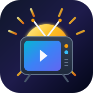

  

<h1 align="center">☀️📺 Suni TV (سانی تی‌وی)</h1>

  <b>تلویزیون زنده، رادیو آنلاین و وبکم‌های سراسر دنیا — رایگان، بدون تبلیغات و بدون نیاز به ثبت‌نام</b>

  
  
  

---

## 📥 دانلود نسخه اندروید و اندروید تی‌وی

برای دانلود مستقیم آخرین نسخه اپلیکیشن (سازگار با گوشی، تبلت، اندروید باکس و تلویزیون هوشمند):

👉 **[دانلود مستقیم فایل نصبی Suni TV v2.2.0](https://github.com/3krbkbkrbrbg/suni-tv/releases/download/v2.2.0/app-release.apk)** (حجم: ۳۵.۹ مگابایت)

همچنین فایل نصبی مستقیم داخل ریپازیتوری در فایل [`suni-tv-release.apk`](suni-tv-release.apk) قرار دارد.

---

## 🌟 امکانات و تغییرات جدید (نسخه v2.2.0)

- 📺 **سازگاری کامل با اندروید تی‌وی (Android TV & Leanback)**: پشتیبانی رسمی از تلویزیون‌های هوشمند، اندروید باکس‌ها و ریموت کنترل (D-Pad). دارای بنر اختصاصی عریض تلویزیون.
- ☀️ **آیکون بازطراحی‌شده سان و تلویزیون**: رفع کامل مشکل نمایش آیکون در اندروید ۸ به بالا (Adaptive Icon) با هماهنگی در تمام لانچرها.
- 🐦 **صفحه خوش‌آمدگویی و حمایت از توسعه‌دهنده**: صفحه آغازین با امکان فالو و حمایت از توسعه‌دهنده در توییتر/ایکس ([@hellboy_code](https://x.com/hellboy_code)) همراه با کلید بستن/رد شدن و دکمه ورود مستقیم (Welcome · Get Started).
- 🛡️ **پروکسی آزاد FCAE روی تمام جریان‌ها حتی یوتوب**: پشتیبانی کامل از پروکسی داخلی حتی در وب‌ویوهای پخش زنده YouTube.
- 📺 **بیش از ۶,۶۰۰ شبکه تلویزیونی زنده**: دسترسی بدون فیلتر به کانال‌های سراسر دنیا.
- 📻 **بیش از ۲۶,۹۰۰ ایستگاه رادیویی آنلاین** و **۴,۱۰۰ وبکم زنده شهری و طبیعت**.
- ⚡ **حالت کاهش مصرف اینترنت (Data Saver)** تا ۸۵٪ صرفه‌جویی در مصرف دیتا.
- 📱 **کنترل چرخش تمام‌صفحه هوشمند و کلید بازگشت بدون خروج ناگهانی**.
- 🚫 **بدون تبلیغات، بدون حساب کاربری و ۱۰۰٪ رایگان**.

---

## ⚙️ راهنمای نصب

1. فایل `suni-tv-release.apk` را روی گوشی یا تلویزیون هوشمند دانلود و نصب کنید.
2. در اولین اجرا، با کلیک روی دکمه توییتر می‌توانید از صفحه [@hellboy_code](https://x.com/hellboy_code) حمایت کنید، یا با دکمه بستن/رد شدن مستقیماً وارد برنامه شوید.
3. در صورت نیاز به عبور از محدودیت‌ها، گزینه پروکسی را در بخش پخش‌کننده فعال کنید.
